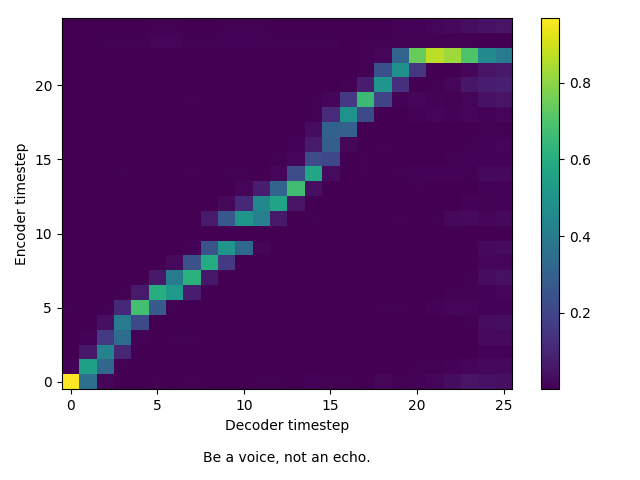
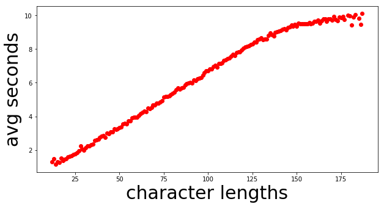
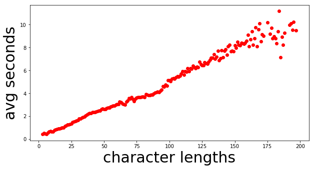
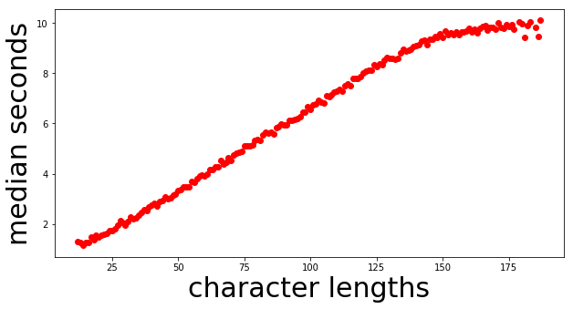
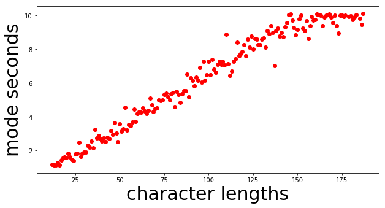
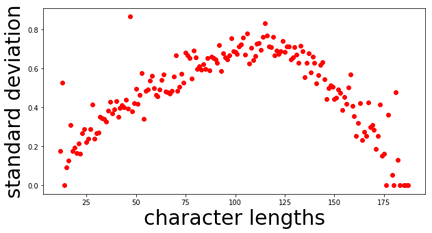
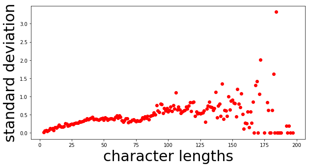
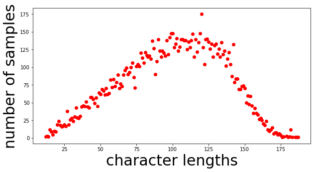
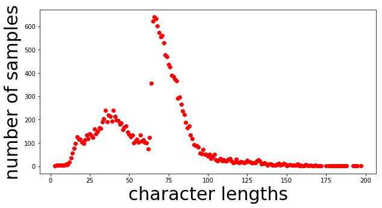
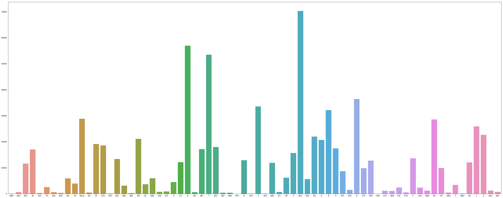

# mimic2

This is a fork of [keithito/tacotron](https://github.com/keithito/tacotron)
with changes specific to Mimic 2 applied. This repo is actively developed on by the Mycroft AI team and community.


## Background

Google published a paper, [Tacotron: A Fully End-to-End Text-To-Speech Synthesis Model](https://arxiv.org/pdf/1703.10135.pdf),
where they present a neural text-to-speech model that learns to synthesize speech directly from
(text, audio) pairs. However, they didn't release their source code or training data. This is an
attempt to provide an open-source implementation of the model described in their paper.

The quality isn't as good as Google's demo yet, but hopefully, it will get there someday :-).
Pull requests are welcome!


## Contributions
Contributions are accepted! We'd love the communities help in building a better speech synthesis engine; weather it be code, or, update on the README, bug reports, etc. For real time conversations, join our [mattermost](https://chat.mycroft.ai/community/channels/machine-learning) chat and enter the machinelearning channel.

## Quick Start

### Installing dependencies

#### using docker (recommended)
1. make sure you have Docker installed

1. Build Docker
   
   The Dockerfile comes with a GPU option or CPU option. If you want to use the GPU in docker make sure you have [nvidia-docker](https://github.com/NVIDIA/nvidia-docker) installed

   gpu: `docker build -t mycroft/mimic2:gpu -f gpu.Dockerfile .`
   
   cpu: `docker build -t mycroft/mimic2:cpu -f cpu.Dockerfile .`

2. Run Docker

   gpu: `nvidia-docker run -it -p 3000:3000 mycroft/mimic2:gpu`
   
   cpu: `docker run -it -p 3000:3000 mycroft/mimic2:cpu`

#### manually
1. Install Python 3.

2. Install the latest version of [TensorFlow](https://www.tensorflow.org/install/) for your platform. For better
   Performance, install with GPU support if it's available. This code has been tested on tensorflow 1.8.

3. Install requirements:
   ```
   pip install -r requirements.txt
   ```

### Training

*Note: you need at least 40GB of free disk space to train a model.*

1. **Download a speech dataset.**

   The following are supported out of the box:
    * [LJ Speech](https://keithito.com/LJ-Speech-Dataset/) (Public Domain)
    * [Blizzard 2012](http://www.cstr.ed.ac.uk/projects/blizzard/2012/phase_one) (Creative Commons Attribution Share-Alike)
    * [M-ailabs](http://www.m-ailabs.bayern/en/the-mailabs-speech-dataset/)

   You can use other datasets if you convert them to the right format. See [TRAINING_DATA.md](TRAINING_DATA.md) for more info.


2. **Unpack the dataset into `~/tacotron`**

   After unpacking, your tree should look like this for LJ Speech:
   ```
   tacotron
     |- LJSpeech-1.1
         |- metadata.csv
         |- wavs
   ```

   alternatively, like this for Blizzard 2012:
   ```
   tacotron
     |- Blizzard2012
         |- ATrampAbroad
         |   |- sentence_index.txt
         |   |- lab
         |   |- wav
         |- TheManThatCorruptedHadleyburg
             |- sentence_index.txt
             |- lab
             |- wav
   ```
   
   For M-AILABS follow the directory structure from [here](http://www.m-ailabs.bayern/en/the-mailabs-speech-dataset/)

3. **Preprocess the data**
   ```
   python3 preprocess.py --dataset ljspeech
   ```
     * other datasets can be used, i.e. `--dataset blizzard` for Blizzard data
     * for the mailabs dataset, do `preprocess.py --help` for options. Also, note that mailabs uses sample_size of 16000
     * you may want to create your own preprocessing script that works for your dataset. You can follow examples from preprocess.py and ./datasets


    preprocess.py creates a train.txt and metadata.txt. train.txt is the file you use to pass to the train.py input parameter. metadata.txt can be used as a reference to get max input length, max output length, and how many hours is your dataset.
  
    **NOTE**
    modify hparams.py to cater to your dataset.

4. **Train a model**
   ```
   python3 train.py
   ```

   Tunable hyperparameters are found in [hparams.py](hparams.py). You can adjust these at the command
   line using the `--hparams` flag, for example `--hparams="batch_size=16,outputs_per_step=2"`.
   Hyperparameters should generally be set to the same values at both training and eval time. **I highly recommend setting the params in the hparams.py file to guarantee consistency during preprocessing, training, evaluating,
   and running the demo server. The --hparams flag will be deprecated soon**

   During training, the script will save the models progress every 1000 steps. You can monitor the progress using tensorboard and also listening to the output of the model. You can find the wav file and alignment chart in a format of step-*. See below for an example of what an alignment should look like.

5. **Monitor with Tensorboard** (optional)
   ```
   tensorboard --logdir ~/tacotron/logs-tacotron
   ```

   The trainer dumps audio and alignments every 1000 steps. You can find these in
   `~/tacotron/logs-tacotron`.

6. **Synthesize from a checkpoint**
  
   ```
   python3 demo_server.py --checkpoint ~/tacotron/logs-tacotron/model.ckpt-185000
   ```
   Replace "185000" with the checkpoint number that you want to use, then open a browser
   to `localhost:3000` and type what you want to speak. Alternately, you can
   run [eval.py](eval.py) at the command line:
  
   ```
   python3 eval.py --checkpoint ~/tacotron/logs-tacotron/model.ckpt-185000
   ```
   If you set the `--hparams` flag when training, set the same value here.

   [eval.py](eval.py) will output sampels define in the sentence list found [here](eval.py). You may modify to your use case.
   eval.py will also output two things, the wavfile, and alignment chart. To have a good alignment, the alignment chart should generally be linear. Below is a good example of a model that output a good alignment for a sample.

   

7. **Analyzing Data**
   
   You can visualize your data set after preprocessing the data. See more details info [here](#visualizing-your-data)
   

## Notes and Common Issues

  * [TCMalloc](http://goog-perftools.sourceforge.net/doc/tcmalloc.html) seems to improve
    Training speed and avoids occasional slowdowns seen with the default allocator. You
    can enable it by installing it and setting `LD_PRELOAD=/usr/lib/libtcmalloc.so`. With TCMalloc,
    you can get around 1.1 sec/step on a GTX 1080Ti.

  * You can train with [CMUDict](http://www.speech.cs.cmu.edu/cgi-bin/cmudict) by downloading the
    dictionary to ~/tacotron/training and then passing the flag `--hparams="use_cmudict=True"` to
    train.py. This will allow you to pass ARPAbet phonemes enclosed in curly braces at eval
    time to force a particular pronunciation, e.g. `Turn left on {HH AW1 S S T AH0 N} Street.`

  * If you pass a Slack incoming webhook URL as the `--slack_url` flag to train.py, it will send
    you progress updates every 1000 steps.

  * Occasionally, you may see a spike in the loss, and the model will forget how to attend (the
    Alignments will no longer make sense). Although it will recover eventually, it may
    save time to restart at a checkpoint before the spike by passing the
    `--restore_step=150000` flag to train.py (replacing 150000 with a step number before the
    spike). **Update**: a recent [fix](https://github.com/keithito/tacotron/pull/7) to gradient
    clipping by @candlewill may have fixed this.
    
  * During eval and training, audio length is limited to `max_iters * outputs_per_step * frame_shift_ms`
    milliseconds. With the defaults (max_iters=200, outputs_per_step=5, frame_shift_ms=12.5), this is
    12.5 seconds.
    
    If your training examples are longer, you will see an error like this:
    `Incompatible shapes: [32,1340,80] vs. [32,1000,80]`
    
    To fix this, you can set a larger value of `max_iters` by passing `--hparams="max_iters=300"` to
    train.py (replace "300" with a value based on how long your audio is and the formula above).
    
  * Here is the expected loss curve when training on LJ Speech with the default hyperparameters:
    

## Other Implementations
  * By Alex Barron: https://github.com/barronalex/Tacotron
  * By Kyubyong Park: https://github.com/Kyubyong/tacotron

## Visualizing Your Data
[analyze.py](analyze.py) is a tool to visualize your dataset after preprocessing. This step is important to ensure quality in the voice generation. The analyze tool takes in train.txt as the data input to do visualizations. `train.txt` is a file created from `preprocess.py`.

Example
```
    python analyze.py --train_file_path=~/tacotron/training/train.txt --save_to=~tacotron/visuals --cmu_dict_path=~/cmudict-0.7b
```

cmu_dict_path is optional if you'd like to visualize the distribution of the phonemes.

analyze.py outputs 6 different plots.

### Average Seconds vs Character Lengths


This tells you what your audio data looks like in the time perspective. This plot shows the average seconds of your audio sample per character length of the sample.

E.g. So for all 50 character samples, the average audio length is 3 seconds. Your data should show a linear pattern like the example above.

Having a linear pattern for time vs. character lengths is vital to ensure a consistent speech rate during audio generation.

Below is a bad example of average seconds vs. character lengths in your dataset. You can see that there is an inconsistency towards the higher character lengths range. At 180, the average audio length was 8 seconds while at 185 the average was 6.



### Median Seconds vs Character Lengths


Another perspective for the time that plots the median.

### Mode Seconds vs Character Lengths


Another perspective for the time that plots the mode.

### Standard Deviation vs Character Lengths


Plots the standard deviation or spread of your dataset. The standard deviation should stay in a range no larger than 0.8.

E.g. For samples with 100 character lengths, the average audio length is 6 seconds. According to the chart above, 100 character lengths have an std of about 0.6. That means most samples in the 100 character length range should be no more than 6.6 seconds and no less than 5.2 seconds.

Having a low standard deviation is vital to ensure a consistent speech rate during audio generation.

Below is an example of a bad distribution of standard deviations.



### Number of Samples vs Character Lengths


Plots the number of samples you have in character lengths range.

E.g. For samples in the 100 character lengths range, there are about 125 samples of it.

It's important to keep this plot as normally distributed as possible so that the model has enough data to produce a natural speech rate. If this char is off balance, you may get weird speech rate during voice generation.

Below is an example of a bad distribution for the number of samples. This distribution will generate sequences in the 25 - 100 character lengths well, but anything past that will have bad quality. In this example, you may experience a speed up in speech rate as the model try to squish 150 characters in 3 seconds.



### Phonemes Distribution


This only output if you use the `--cmu_dict_path` parameter. The X-axis is the unique phonemes, and the Y-axis shows how many times that phoneme shows up in your dataset. We are still experimenting with how the distribution should look, but the theory is having a balanced distribution of phonemes will increase quality in pronunciation.

### Tips
If your data looks bad, you can try resampling methods to change the shape of your data. For example, to fix the bad number of samples chart. You can try to delete samples and copy samples to make the chart look more normally distributed. For standard deviation, you can remove data that causes your standard deviation of have a large spread. 
